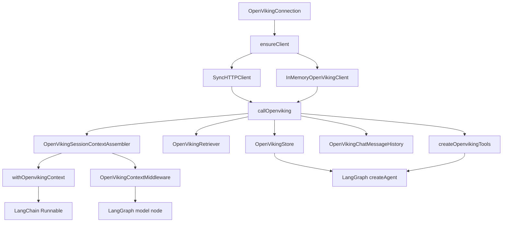

## What this is

`@grubgenie/openviking-memory-layer` is a TypeScript port of `openviking.integrations.langchain` — OpenViking memory adapters for [LangChain.js](https://js.langchain.com) and [LangGraph.js](https://langchain-ai.github.io/langgraphjs/). It gives an agent durable per-user memory (`OpenVikingStore`), semantic retrieval (`OpenVikingRetriever`), model-callable memory tools (`createOpenvikingTools`), session-persisted chat history (`OpenVikingChatMessageHistory`), and automatic recall/capture around a model call (`withOpenvikingContext`, `OpenVikingContextMiddleware`) — all over one shared connection to an OpenViking server (or an in-memory stand-in for tests). See [README.md](../README.md) for the full install/usage reference this wiki summarizes and links into, rather than duplicates.

## Architecture at a glance

See [Layered Design](architecture/layered-design.md) for the full breakdown.

## Navigation

### Architecture

- [Layered Design](architecture/layered-design.md) — the shared connection + dispatch kernel underlying every adapter
- [Connection and Clients](architecture/connection-and-clients.md) — SyncHTTPClient vs InMemoryOpenVikingClient
- [Data / Index Duality](architecture/data-and-index-duality.md) — OpenVikingStore's dual data+index writes

### Modules (one per `src/` file)

- [Package barrel (index.ts)](modules/index.md)
- [Client Kernel (client.ts)](modules/client.md)
- [SyncHTTPClient (http_client.ts)](modules/http_client.md)
- [InMemoryOpenVikingClient (testing.ts)](modules/testing.md)
- [OpenVikingStore (store.ts)](modules/store.md)
- [OpenVikingRetriever (retrievers.ts)](modules/retrievers.md)
- [createOpenvikingTools (tools.ts)](modules/tools.md)
- [OpenVikingChatMessageHistory (history.ts)](modules/history.md)
- [OpenVikingSessionContextAssembler / withOpenvikingContext (context.ts)](modules/context.md)
- [OpenVikingContextMiddleware (middleware.ts)](modules/middleware.md)

### Flows

- [Full agent with store and tools](flows/full-agent-with-store-and-tools.md)
- [Session commit and archival](flows/session-commit-and-archival.md)
- [Context injection and history](flows/context-injection-and-history.md)
- [Store put / get / search](flows/store-put-get-search.md)

### Concepts

- [Connection settings](concepts/connection.md)
- [Identity and scoping](concepts/identity-and-scoping.md)
- [Commit policy](concepts/commit-policy.md)
- [Content mode](concepts/content-mode.md)
- [Tool profiles](concepts/tool-profiles.md)
- [find vs search](concepts/find-vs-search.md)

### Guides

- [Testing without a server](guides/testing-without-a-server.md)
- [Adding a new viking_* tool](guides/adding-a-viking-tool.md)
- [Wiring a LangGraph agent](guides/wiring-a-langgraph-agent.md)

### Upstream watch

- [OpenViking 0.4.x User/Peer model vs. this repo's current identity model](../research/openviking-0.4-user-peer-model-vs-current-implementation.md) — provisional research note; server is upgradable at will but the migration is deliberately deferred (no forcing function, existing bugs take priority). See [Identity and scoping](concepts/identity-and-scoping.md) for the concept it affects.

### Change log

[wiki/log.md](log.md) — append-only audit trail of wiki generation/refresh runs.
