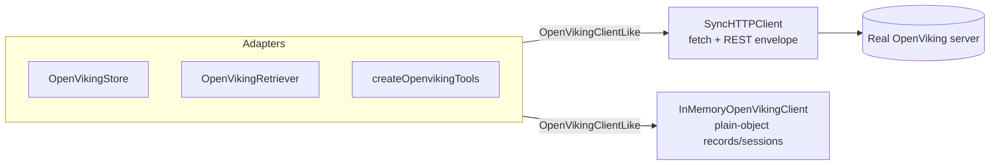

## Overview

Every adapter talks to an `OpenVikingClientLike` — a minimal structural type, not a concrete class. Two implementations satisfy it: [SyncHTTPClient](../modules/http_client.md) (production, talks to a real server) and [InMemoryOpenVikingClient](../modules/testing.md) (deterministic, no network). Swapping one for the other requires no adapter code changes.

## Diagram

## Components

- **SyncHTTPClient** — unwraps the `{status, result, error}` envelope, sets identity headers (`X-API-Key`, `X-OpenViking-Account`, `X-OpenViking-User`, `X-OpenViking-Actor-Peer`), applies an `AbortController` timeout.
- **InMemoryOpenVikingClient** — deterministic token-match retrieval over an in-memory `records` map; implements the same session lifecycle (`create_session` → `add_message` → `commit_session`) purely in memory. Used by every example under `examples/` and every test under `test/`.

## Design decisions

The HTTP client is request-scoped (`fetch`), so there's no persistent connection state to recover after a transient error — this is why `ensureClient` in [client.ts](../../src/client.ts) doesn't need the Python one-shot recovery wrapper.

## Related modules / flows

[SyncHTTPClient module](../modules/http_client.md), [InMemoryOpenVikingClient module](../modules/testing.md), [Testing without a server](../guides/testing-without-a-server.md)
