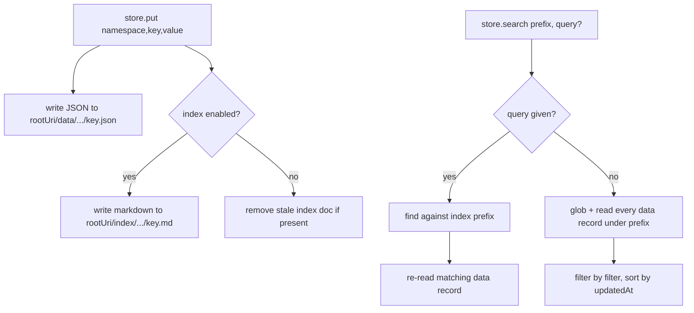

## Overview

[OpenVikingStore](../modules/store.md) writes every value twice, to two different purposes: an exact JSON record for `get`/`put`, and a markdown projection for semantic `search`.

## Diagram

## Components

- **Data record** (`<rootUri>/data/<namespace>/<key>.json`) — exact, immediate; the only thing `get()` reads.
- **Index document** (`<rootUri>/index/<namespace>/<key>.md`) — a projection (`projectValue`) of the value, or the whole value when `index` isn't an explicit field list; feeds semantic `find`.
- `search()` branches: with a `query`, it hits `find` scoped to the index prefix then re-reads each hit's data record (so results are always the true current value, not a stale projection); without one, it lists and locally filters/sorts every data record under the prefix.

## Design decisions

- **`rootUri` must stay bare.** `viking://user/memories` is a literal alias token the server exact-matches and rewrites to the caller's real per-user path. Any extra path segment (e.g. a `/langgraph_store` suffix) breaks that exact-match and falls through to one unscoped path shared by every caller — see the gotcha on the [store module page](../modules/store.md).
- **Canonicalized-URI fallback intentionally unimplemented.** The Python port's `_parse_canonicalized_record_uri` (which used `openviking.core.namespace.classify_uri`) is a documented no-op here — in-memory and HTTP retrieval always return the literal URIs written, which start with the configured root prefix, so the direct prefix parser (`parseRecordUri`) covers every case the adapters exercise.

## Related modules / flows

[OpenVikingStore module](../modules/store.md), [Store put/get/search flow](../flows/store-put-get-search.md), [Identity and scoping](../concepts/identity-and-scoping.md)
