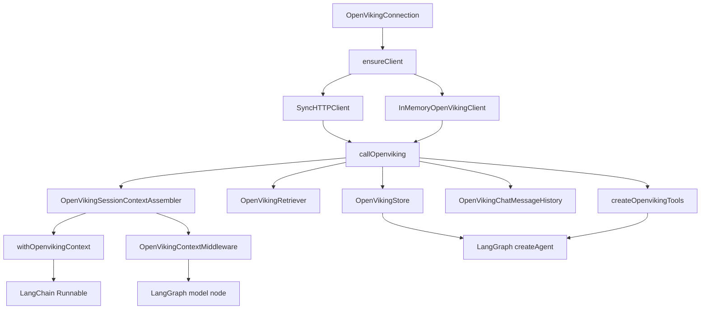

## Overview

Every adapter in this package (store, retriever, tools, history, context assembler, middleware) is built on the same two primitives: one connection shape (`OpenVikingConnection`) and one dispatch function (`callOpenviking`). Adapters differ only in *what* they call and how they shape the result — not in *how* they call it.

## Diagram

## Components

- [Client kernel](../modules/client.md) — `OpenVikingConnection`, `ensureClient`, `callOpenviking`, commit-policy helpers.
- [SyncHTTPClient](../modules/http_client.md) and [InMemoryOpenVikingClient](../modules/testing.md) — interchangeable `OpenVikingClientLike` implementations (see [Connection and clients](connection-and-clients.md)).
- Six adapters, each a thin translation layer over the kernel: [store](../modules/store.md), [retrievers](../modules/retrievers.md), [tools](../modules/tools.md), [history](../modules/history.md), [context](../modules/context.md), [middleware](../modules/middleware.md).

## Design decisions

- **Options-object methods, not positional args.** Every client method takes one options object; `callOpenviking` strips `undefined` fields before dispatch — the JS analog of Python's None-kwarg filtering.
- **No async recovery wrapper.** Python's one-shot transient-error recovery handle is dropped: `SyncHTTPClient` is request-scoped (`fetch`), so `ensureClient` just returns the client directly. `RETRYABLE_READ_METHODS` is kept in [client.ts](../../src/client.ts) only for reference parity with the Python port.
- **snake_case protocol, camelCase options.** Client methods keep snake_case protocol names (`create_session`, `add_message`, …) so `callOpenviking` maps 1:1 to the Python adapters; option objects use camelCase (`targetUri`, `scoreThreshold`).

## Related modules / flows

[Full agent with store and tools](../flows/full-agent-with-store-and-tools.md), [Context injection and history](../flows/context-injection-and-history.md)
