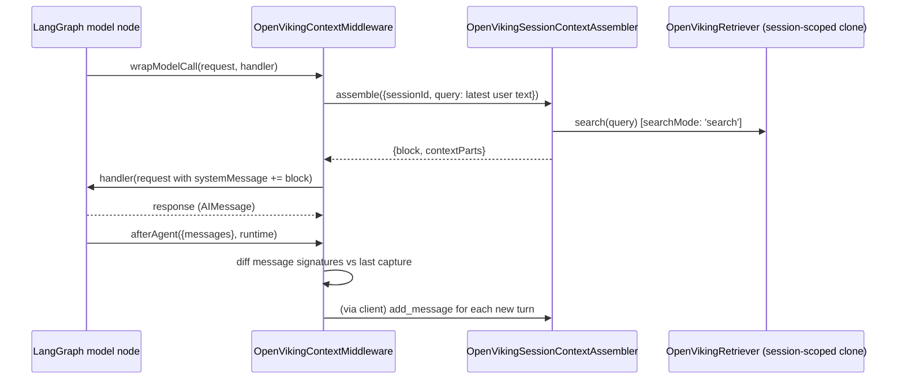

## Overview

Two call sites share one assembler: [`OpenVikingSessionContextAssembler`](../modules/context.md) builds a single `<openviking_context>` block from session archive state + active messages + semantic recall. `withOpenvikingContext` wraps a LangChain `Runnable`; `OpenVikingContextMiddleware` hooks a LangGraph node.

## Diagram

## Steps

1. **Recall.** `wrapModelCall`/`inject` gets the latest user text (`getLatestUserText`), calls `assembler.assemble()`, which reads `get_session_context` and runs a session-scoped semantic `search` via a cloned [OpenVikingRetriever](../modules/retrievers.md).
2. **Inject.** The assembled block is merged into (or becomes) the request's `SystemMessage` before the model call.
3. **Capture.** After the model responds, new messages (those the middleware hasn't seen before, by signature) are persisted via `add_message`, with any pending recall context parts attached to the next assistant turn.
4. **Commit.** If a [commit policy](../concepts/commit-policy.md) is configured, it's applied after capture.

## Failure modes

- **Signature-based dedup can misdetect.** `afterAgent` compares `messageSignature()` (id + role + content + tool_calls + tool_result) across calls to avoid re-persisting already-captured turns; a message that's mutated in place between calls without changing these fields would be missed.
- **Missing session id throws.** `resolveSessionId` throws `SESSION_ID_ERROR` if no `sessionIdResolver`, `state.thread_id`/`state.session_id`, nor `runtime.config.configurable.thread_id`/`session_id` is present — there is no silent fallback.
- **Injected context never re-persisted as a user turn.** Messages already containing the `OPENVIKING_CONTEXT_MARKER` are skipped during capture, by design — but a hand-built message that happens to contain that literal string would also be skipped.

## Related modules / concepts

[context module](../modules/context.md), [middleware module](../modules/middleware.md), [history module](../modules/history.md), [retrievers module](../modules/retrievers.md), [Commit policy](../concepts/commit-policy.md)
