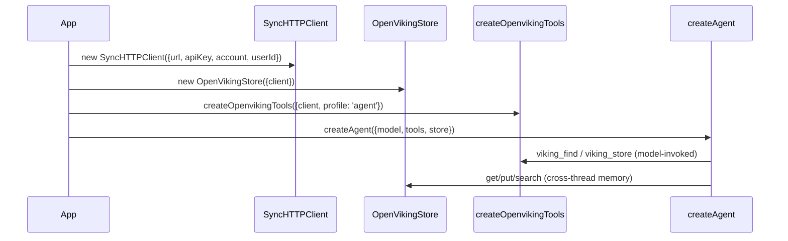

## Overview

The README's "Full agent example": one `SyncHTTPClient` shared across an `OpenVikingStore` (durable long-term memory) and `createOpenvikingTools` (model-callable memory ops), wired into `createAgent`.

## Diagram

## Steps

1. Build one `SyncHTTPClient` with `account`/`userId` identity (or reuse an existing `client`).
2. Pass the same `client` into `new OpenVikingStore({ client })` and `createOpenvikingTools({ client, profile: 'agent' })` — sharing avoids spinning up redundant connections and keeps identity headers consistent.
3. Hand both to `createAgent({ model, tools, store })`. LangGraph drives the store exclusively through `OpenVikingStore.batch()`; the model calls `viking_*` tools directly.

## Failure modes

- **Not sharing the client.** Constructing a separate `SyncHTTPClient` per adapter still works, but doubles connection setup and risks inconsistent identity headers if the settings drift apart.
- **`rootUri` suffix breaks per-user isolation.** See the [store module gotcha](../modules/store.md) — an app-specific suffix on `rootUri` silently falls through to one shared unscoped path.
- **Wrong tool profile for trust level.** Default `profile: 'agent'` includes writes (`viking_store`, `viking_add_resource`, `viking_add_skill`); `viking_forget` is opt-in only (`allowForget: true` or `profile: 'admin'`) — see [Tool profiles](../concepts/tool-profiles.md).

## Related modules / concepts

[store module](../modules/store.md), [tools module](../modules/tools.md), [client module](../modules/client.md), [Tool profiles](../concepts/tool-profiles.md), [Identity and scoping](../concepts/identity-and-scoping.md)
