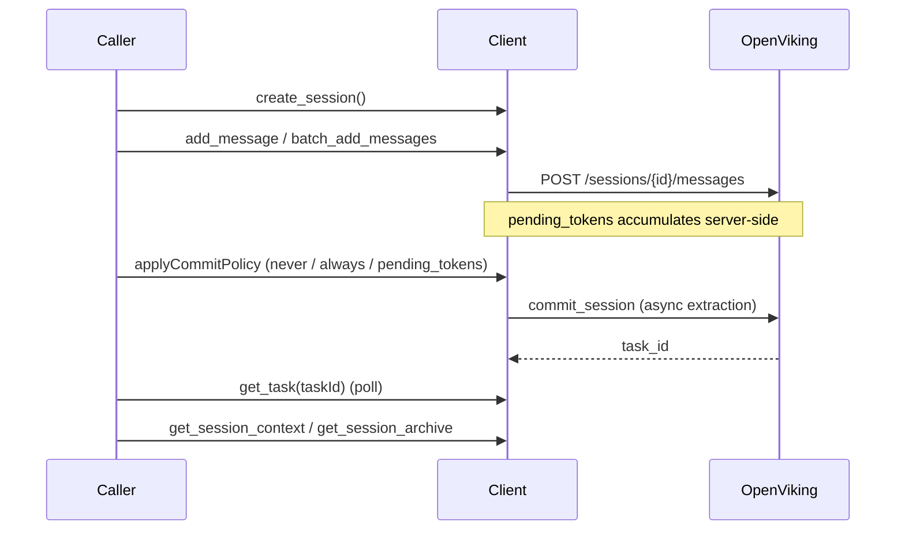

## Overview

The session lifecycle underlying [history](../modules/history.md), [context assembly](../modules/context.md), and [middleware](../modules/middleware.md): messages accumulate, then get committed (extracted into long-term memory) either explicitly or per a [commit policy](../concepts/commit-policy.md).

## Diagram

## Steps

1. `create_session({ sessionId? })` — creates or no-ops if it already exists.
2. `add_message` / `batch_add_messages` — appends message parts; the server accumulates `pending_tokens` for the session.
3. `applyCommitPolicy` (in [client.ts](../../src/client.ts)) decides whether to commit now: `never` (default, no-op), `always` (commit every time), or `pending_tokens` (reads `get_session` and commits only once `pending_tokens` crosses `pendingTokenThreshold`, default 8000).
4. `commit_session` triggers async extraction on the server; `get_task(taskId)` polls it.
5. Later reads use `get_session_context` (active messages + latest archive overview + pre-archive abstracts) or `get_session_archive` for one specific archive.

## Failure modes

- **Silent no-op on lookup failure.** In `pending_tokens` mode, `applyCommitPolicy` catches a failed `get_session` call and returns `null` rather than committing — a transient error here silently skips a scheduled commit.
- **Semantic search lag after commit.** Per the README: semantic `search`/`find` depends on the server's async embedding pipeline, so a `query` made right after a `put`/commit may not yet surface it. The KV path (`get`/`put`/`delete` on [OpenVikingStore](../modules/store.md)) is exact and immediate; only the semantic path is eventually consistent.

## Related modules / concepts

[client module](../modules/client.md), [history module](../modules/history.md), [Commit policy](../concepts/commit-policy.md)
