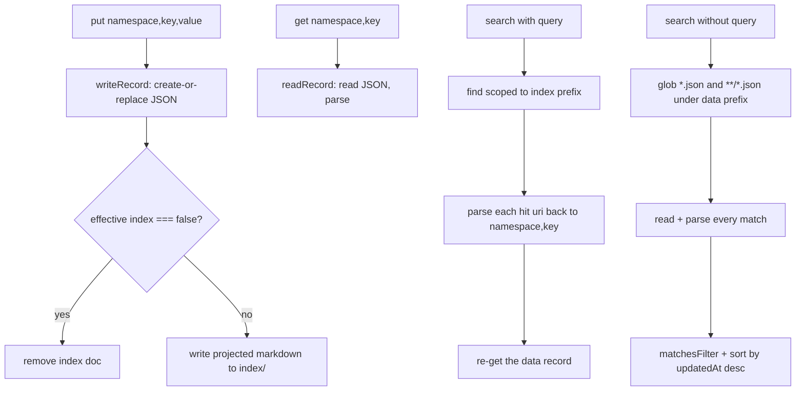

## Overview

See [Data / Index Duality](../architecture/data-and-index-duality.md) for the storage design this flow walks through step by step.

## Diagram

## Steps

1. **`put`** writes the JSON data record first (create, falling back to read-then-replace to preserve `created_at` if it already exists), then writes or removes the index projection depending on the effective `index` setting.
2. **`get`** reads the data record directly — exact and immediate, no index involved.
3. **`search(query)`** dispatches `find` scoped to `<rootUri>/index/<prefix>`, parses each hit's URI back into `(namespace, key)`, and re-reads the *data* record (not the index projection) so results reflect the true current value.
4. **`search()` without a query** globs every `*.json` under the data prefix (both `*.json` and `**/*.json` patterns, deduplicated, to catch flat and nested layouts), reads each, applies the `filter`, and sorts by `updatedAt` descending.

## Failure modes

- **Index write failures are swallowed.** The private `write()` helper tries create, then falls back to replace on failure, and only re-throws if *both* fail — a permissions or transient error on the create path is silently absorbed as long as replace succeeds.
- **Toggling `index: false` requires an explicit put.** There's no background sweep; a stale index doc from a prior `put` with indexing on only gets removed the next time `put` runs with `index: false` for that same key.

## Related modules / concepts

[store module](../modules/store.md), [Data / Index Duality](../architecture/data-and-index-duality.md)
